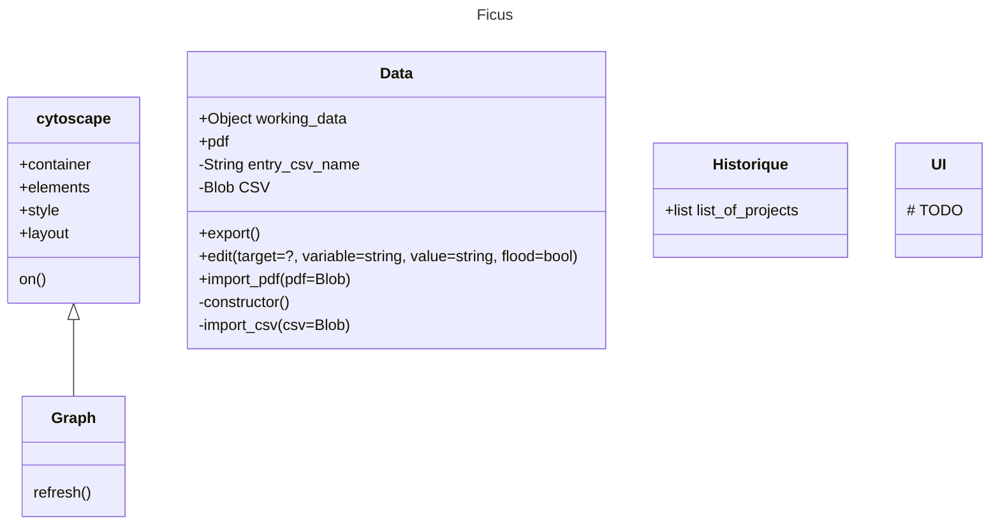

```mermaid
---
title: Ficus
---
classDiagram
    cytoscape <|-- Graph
    class Data{
        +Object working_data
        +pdf
        -String entry_csv_name
        -Blob CSV
        +export()
        +edit(target=?, variable=string, value=string, flood=bool)
        +import_pdf(pdf=Blob)
        -constructor()
        -import_csv(csv=Blob)
    }
    class Historique{
        +list list_of_projects
    }
    class cytoscape{
        +container
        +elements
        +style
        +layout
        on()
    }
    class Graph{
        refresh()
    }
    class UI{
        # TODO
    }
```