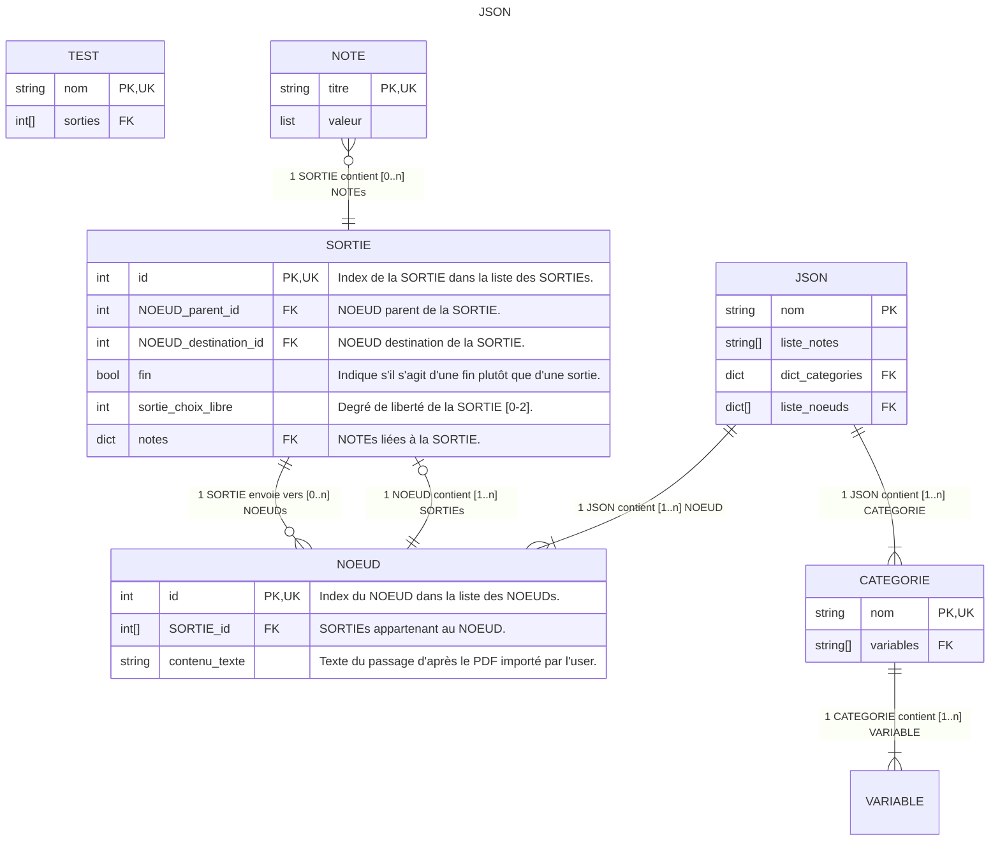

Notes:

- Le JSON est un **compromis**. Il ne s'agit pas d'un fichier chargé en mémoire sur lequel le logiciel travaille, mais d'un fichier permettant de **sauvegarder** les données à des **moments déterminés**.
- Un fichier JSON est intéressant car **lisible par un être humain**. L'intérêt est d'être **facilement utilisable** par d'autres outils.
- Les données du JSON sont **chargées en mémoire** par le logiciel via un processus d'import.



```json
{
	"document": {
		"nom": "Nom du document."
	},
	"liste_notes": [
		"doute",
		"commentaire",
		"action",
		"duree",
		"environnement",
		"illustration",
		"description_fin",
		"combat",
		"blessure",
		"objet_acquis",
		"objet_requis",
		"objet_perdu",
		"code_acquis",
		"code_perdu",
		"code_requis",
		"carte",
		"enigme",
		"indice_acquis",
		"test_aleatoire",
		"competence_requise",
		"test_competence",
		"etat_du_monde_acquis",
		"sortie_test_aleatoire",
		"sortie_etat_du_monde_requis",
		"sortie_objet_requis",
		"sortie_objet_acquis",
		"sortie_objet_perdu",
		"sortie_competence_requise",
		"sortie_test_competence",
		"sortie_code_acquis",
		"sortie_code_requis",
		"sortie_mot_de_passe_perdu",
		"sortie_enigme_requise"
	],
	"dict_categories": {
		"nom_categorie": {
			"nom_variable": [
				0,
				1,
				2,
				3
			]
		}
	},
	"noeuds": [
		{
			"id": 0,
			"contenu_texte": "Texte du passage d'après le PDF importé par l'user.",
			"sorties": [
				{
					"id": 0,
					"parent_id": 0,
					"destination_id": 0,
					"fin": true,
					"sortie_choix_libre": 0,
					"notes": {
						"doute": "",
						"commentaire": "",
						"action": "",
						"duree": "",
						"environnement": "",
						"illustration": "",
						"description_fin": "",
						"combat": "",
						"blessure": "",
						"objet_acquis": "",
						"objet_requis": "",
						"objet_perdu": "",
						"code_acquis": "",
						"code_perdu": "",
						"code_requis": "",
						"carte": "",
						"enigme": "",
						"indice_acquis": "",
						"test_aleatoire": "",
						"competence_requise": "",
						"test_competence": "",
						"etat_du_monde_acquis": "",
						"sortie_test_aleatoire": "",
						"sortie_etat_du_monde_requis": "",
						"sortie_objet_requis": "",
						"sortie_objet_acquis": "",
						"sortie_objet_perdu": "",
						"sortie_competence_requise": "",
						"sortie_test_competence": "",
						"sortie_code_acquis": "",
						"sortie_code_requis": "",
						"sortie_mot_de_passe_perdu": "",
						"sortie_enigme_requise": ""
					}
				}
			]
		}
	]
}
```

### Exemple

```json
{
	"document": {
		"nom": "Nom du document."
	},
	"liste_notes": [
		"doute",
		"commentaire",
		"action",
		"duree",
		"environnement",
		"illustration",
		"description_fin",
		"combat",
		"blessure",
		"objet_acquis",
		"objet_requis",
		"objet_perdu",
		"code_acquis",
		"code_perdu",
		"code_requis",
		"carte",
		"enigme",
		"indice_acquis",
		"test_aleatoire",
		"competence_requise",
		"test_competence",
		"etat_du_monde_acquis",
		"sortie_test_aleatoire",
		"sortie_etat_du_monde_requis",
		"sortie_objet_requis",
		"sortie_objet_acquis",
		"sortie_objet_perdu",
		"sortie_competence_requise",
		"sortie_test_competence",
		"sortie_code_acquis",
		"sortie_code_requis",
		"sortie_mot_de_passe_perdu",
		"sortie_enigme_requise"
	],
	"dict_categories": {
		"nom_categorie": {
			"nom_variable": [
				0,
				1,
				2,
				3
			]
		},
		"monstre": {
			"monstre des âbimes": [
				203
			]
		}
	},
	"noeuds": [
		{
			"id": 203,
			"contenu_texte": "Texte du passage d'après le PDF importé par l'user.",
			"sorties": [
				{
					"id": 0,
					"parent_id": 203,
					"destination_id": [],
					"fin": true,
					"sortie_choix_libre": 0,
					"notes": {
						"doute": [
							"préciser la mort dans description_fin ?"
						],
						"action": [
							"combattre"
						],
						"test_competence": [
							"chance"
						],
						"sortie_test_competence": [
							"chance"
						],
						"combat": [
							[
								"monstre des âbimes",
								1
							]
						]
					}
				},
				{
					"id": 1,
					"parent_id": 203,
					"destination_id": 258,
					"fin": false,
					"sortie_choix_libre": 0,
					"notes": {
						"doute": [
							"préciser la mort dans description_fin ?"
						]
					}
				}
			]
		}
	]
}
```

