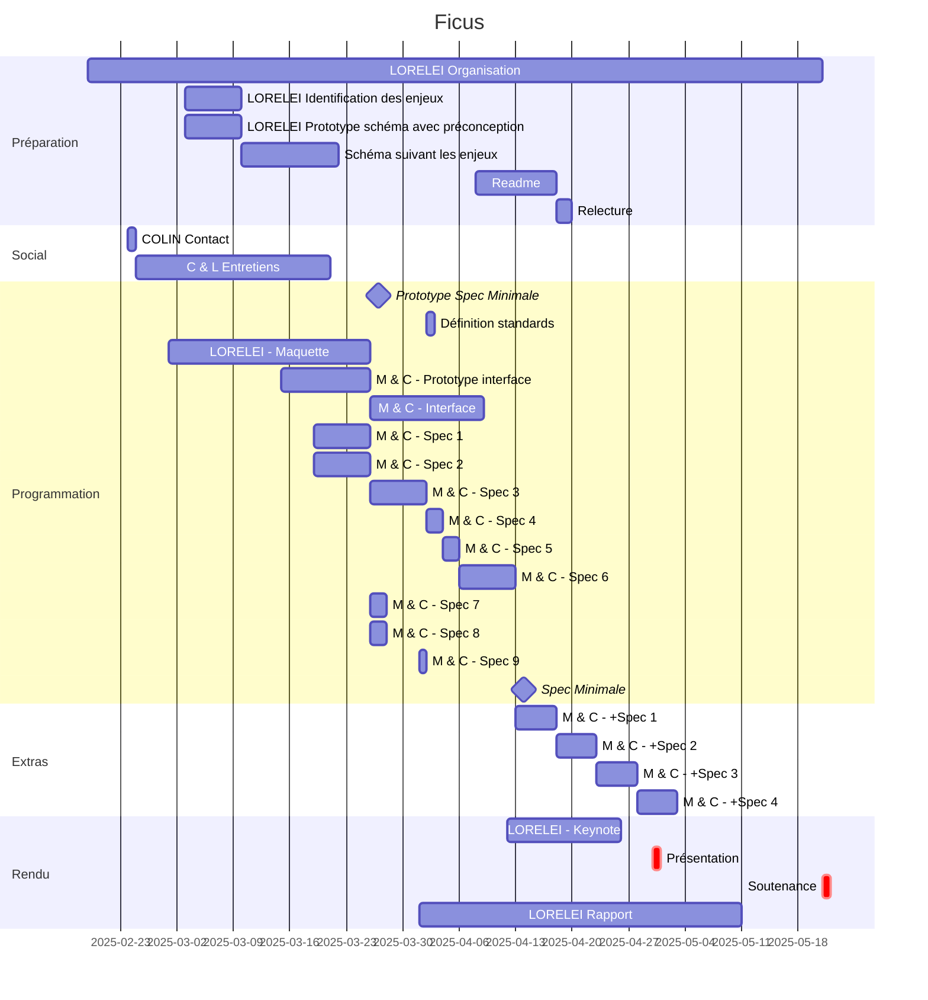

```mermaid
gantt
    title Ficus
    dateFormat  YYYY-MM-DD

    section Préparation
    LORELEI Organisation: prep-1, 2025-02-19, 2025-05-21
    LORELEI Identification des enjeux: prep-2, 2025-03-03, 2025-03-10
    LORELEI Prototype schéma avec préconception: 2025-03-03, 2025-03-10
    Schéma suivant les enjeux: after prep-2, 12d
    Readme: prep-5, 2025-04-08, 10d
    Relecture: after prep-5, 2d

    section Social
    COLIN Contact      :s1, 2025-02-24  , 1d
    C & L Entretiens      :after s1, 24d

    section Programmation
    Prototype Spec Minimale: milestone, 2025-04-02
    Définition standards: 1d
    LORELEI - Maquette: m1, 2025-03-01, 2025-03-26
    M & C - Prototype interface: 2025-03-15, 2025-03-26
    M & C - Interface: after m1, 14d
    M & C - Spec 1: spec_1, 2025-03-19, 7d
    M & C - Spec 2: spec_2, 2025-03-19, 7d
    M & C - Spec 3: spec_3, after spec_2, 7d 
    M & C - Spec 4: spec_4, after spec_3, 2d
    M & C - Spec 5: spec_5, after spec_4, 2d
    M & C - Spec 6: spec_6, after spec_5, 7d
    M & C - Spec 7: spec_7, 2025-03-26, 2d
    M & C - Spec 8: spec_8, after spec_1, 2d
    M & C - Spec 9: spec_9, 2025-04-01, 1d
    Spec Minimale: milestone, 2025-04-26
    
    section Extras
    M & C - +Spec 1: espec_1, after spec_6, 5d
    M & C - +Spec 2: espec_2, after espec_1, 5d
    M & C - +Spec 3: espec_3, after espec_2, 5d
    M & C - +Spec 4: espec_4, after espec_3, 5d

    section Rendu
    LORELEI - Keynote: 2025-04-12, 14d
    Présentation: crit, r1, 2025-04-30, 1d
    Soutenance: crit, r2, 2025-05-21, 1d
    LORELEI Rapport: 2025-04-01, 40d
```
